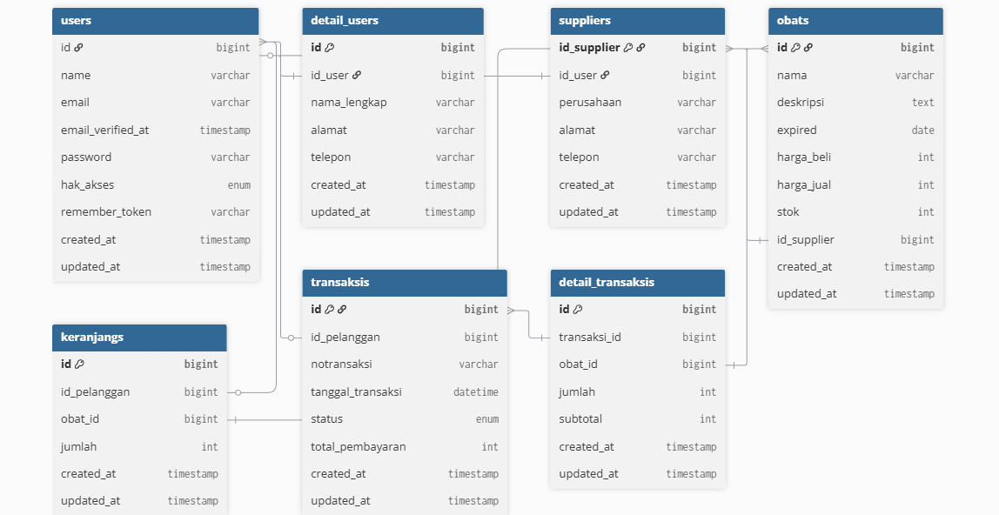
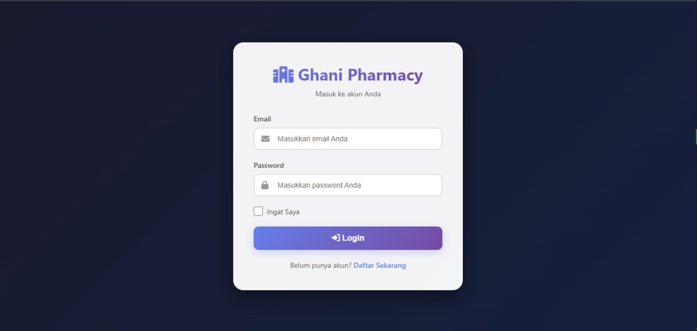
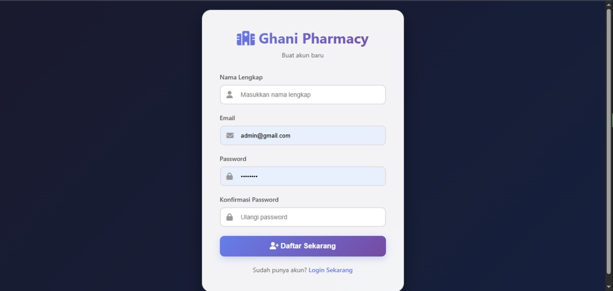
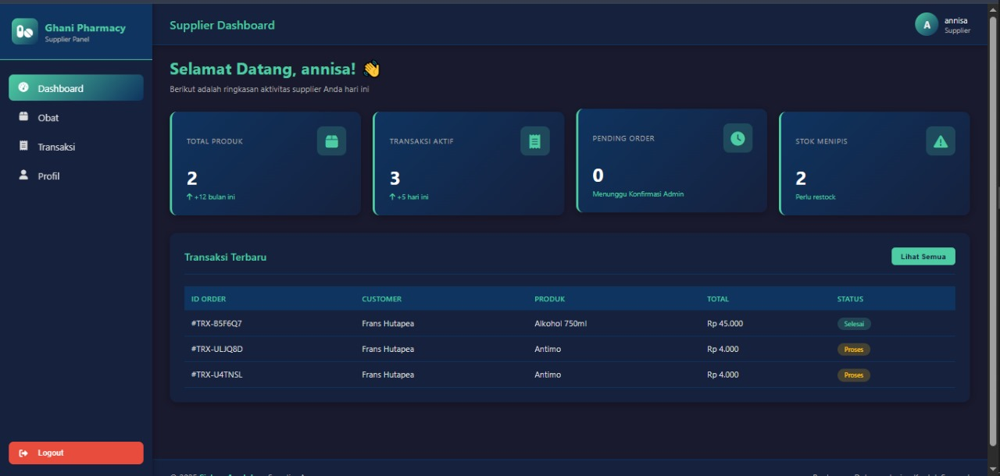

[](https://laravel.com/)

# Apotek Management System

Aplikasi sistem manajemen apotek berbasis web berbasis **Laravel**, dengan role **Admin**, **Supplier**, dan **Customer**. Sistem mencakup pengelolaan obat, transaksi penjualan, pemasok, hingga dashboard terpisah untuk setiap role.

---

## Fitur Utama

### Admin
- Login ke dashboard admin.
- CRUD data obat.
- CRUD data pemasok.
- Mengelola akun pelanggan dan supplier.
- Melihat transaksi & mengubah status (Pending, Proses, Selesai, Batal).
- Ringkasan stok menipis & obat kedaluwarsa.
- Laporan penjualan.

### Supplier
- Login ke dashboard supplier.
- Mengelola produk yang mereka pasok.
- Melihat transaksi masuk.
- Memantau stok menipis.

### Customer
- Registrasi & login.
- Melihat daftar obat dan detail produk.
- Melakukan pembelian.
- Riwayat transaksi & status pesanan.
- Keranjang belanja.

---

## Tools

- **Framework:** Laravel (versi terbaru)
- **Database:** MySQL
- **Frontend:** Bootstrap 5, Font Awesome, HTML5, CSS3
- **Server:** PHP 8.0+

---

## Requirement

Pastikan kamu telah menginstal:

- PHP ≥ 8.0  
- Composer  
- MySQL  
- Git  

---

## Instalasi

1. Clone repository:
   ```bash
   git clone https://github.com/username/Apotek-Management-System.git
   cd Apotek-Management-System
   ```

2. Install dependency:
   ```bash
   composer install
   ```

3. Copy konfigurasi environment:
   ```bash
   cp .env.example .env
   ```

4. Sesuaikan konfigurasi database Anda:
   ```
   DB_CONNECTION=mysql
   DB_HOST=127.0.0.1
   DB_PORT=3306
   DB_DATABASE=apotik
   DB_USERNAME=root
   DB_PASSWORD=
   ```

5. Generate key:
   ```bash
   php artisan key:generate
   ```

6. Migrasi database:
   ```bash
   php artisan migrate
   ```

8. Jalankan aplikasi:
   ```bash
   php artisan serve
   ```

Aplikasi dapat diakses melalui:

```
http://localhost:8000
```

---

## Membuat Akun Manual (Tanpa Seeder)

Project ini **tidak menyediakan akun default** untuk Admin, Supplier, atau Customer.  
Anda dapat membuat akun sendiri menggunakan **PHP Tinker**.

### 1. Jalankan Tinker
```bash
php artisan tinker
```

### 2. Buat Akun User Berdasarkan Role
```php
$user = new \App\Models\User();
$user->name = 'Admin Sistem';    // ubah sesuai kebutuhan
$user->email = 'admin@example.com';
$user->password = bcrypt('password123');
$user->role = 'admin';            // pilihan: admin | supplier | customer
$user->save();
```

### 3. (Opsional) Tambahkan Detail User
```php
$detail = new \App\Models\DetailUser();
$detail->user_id = $user->id;
$detail->alamat = 'Alamat contoh';
$detail->telepon = '08123456789';
$detail->save();
```

Login dengan akun tersebut

---

## Struktur Tabel Utama (ERD)

Tabel inti sistem:

- **users**
- **detail_users**
- **suppliers**
- **obats**
- **transaksis**
- **detail_transaksis**

ERD


---

## Preview UI


Kemudian tampilkan seperti berikut:


1. Register Page


2. Login Page


3. Admin Dashboard


4. Supplier Dashboard


5. Customer Dashboard

